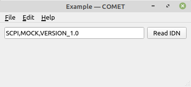

# COMET

Control and Measurement Toolkit
{: .fs-6 .fw-300 }

A [Qutie](https://github.com/arnobaer/qutie) powered rapid development tool for
creating graphical measurement desktop applications for scientific laboratory
use. Inspired by [QCoDeS](https://github.com/QCoDeS/Qcodes),
[Lantz](https://github.com/LabPy/lantz),
[Slave](https://github.com/p3trus/slave),
[FluidLab](https://github.com/fluiddyn/fluidlab) and
[Dash](https://github.com/plotly/dash).

## Getting started

### Dependencies

COMET depends on [PyVISA](https://pyvisa.readthedocs.io/en/latest) for
instrument communication and [Qutie](https://github.com/arnobaer/qutie) for the
graphical user interface. It runs on both Linux and Windows operating systems.

### Install

Install from GitHub using pip

```bash
pip install git+https://github.com/hephy-dd/comet.git@0.10.0
```

### Quick start

COMET provides a basic application window and a set of modules for instrument
communication and threaded processes.

The following minimal example registers a VISA compatible instrument, a callback
action and invokes the application's main window providing a layout with a text
field and a button.

```python
import comet

# Create application
app = comet.Application("example")
app.title = "Example"
app.width = 460
app.height = 240

# Register a VISA resource
app.resources.add("instr", comet.Resource("ASRL2::INSTR", visa_library="@sim"))

# Load stored resource settings (optional)
app.resources.load_settings()

# Define a callback
def on_update():
    with app.resources.get("instr") as instr:
        idn_text.value = instr.query("*IDN?")

# Create read-only text input
idn_text = comet.Text(readonly=True)

# Create read button with on-click callback
read_button = comet.Button("Read IDN", clicked=on_update)

# Create window layout
app.layout = comet.Column(
    comet.Row(
        idn_text,
        read_button
    ),
    comet.Spacer()
)

# Run event loop
app.run()
```



## About the project

COMET is &copy; 2019-2020 by [Bernhard Arnold](https://github.com/arnobaer/),
Institute of High Energy Physics, Austrian Academy of Sciences.

### License

COMET is licensed under the
[GNU General Public License Version 3](https://github.com/hephy-dd/comet/tree/master/LICENSE).
